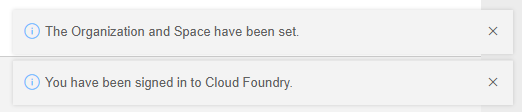
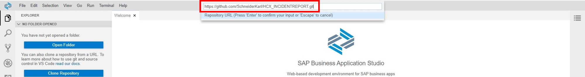
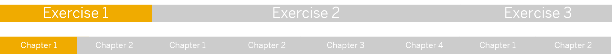

# Chapter 1: Access SAP Business Application Studio and create a project

< [Back to Exercise 1](./README.md)

## Table of contents

<!-- TOC -->

- [Chapter 1: Access SAP Business Application Studio and create a project](#chapter-1-access-sap-business-application-studio-and-create-a-project)
  - [Table of contents](#table-of-contents)
  - [Access Business Application Studio](#access-business-application-studio)
  - [Create Development Space](#create-development-space)
  - [Set Cloud Foundry Endpoint](#set-cloud-foundry-endpoint)
  - [Import the project](#import-the-project)
  - [Open the project and adjust the explorer](#open-the-project-and-adjust-the-explorer)
  - [Expand SAP HANA Projects tab](#expand-sap-hana-projects-tab)
  - [Bind User-Provided Service](#bind-user-provided-service)
  - [Bind HDI Container](#bind-hdi-container)
  - [Deploy the project to HANA Cloud](#deploy-the-project-to-hana-cloud)
  - [What you achieved in this chapter:](#what-you-achieved-in-this-chapter)

<!-- /TOC -->

## Access Business Application Studio

1) Click [here](https://xaea1811-cf-eu10.eu10cf.applicationstudio.cloud.sap/index.html) to open the Business Application Studio (BAS for short). 

2) Please use the P-User with the initial password `Initial1` that was included in the email to log in to BAS. You will be prompted to change your initial password.

   

## Create Development Space

1) Click on **Create Dev Space** to create a new development environment for your project. 

   

2) Give your Development Space the Name **HCX** and make sure to select **SAP HANA Native Application** as application. You do not need to add any Additional SAP Extension. Click on **Create Dev Space**.

   

3) Your HXC Dev Space is being created right now. It takes roughly 2-3 minutes to switch from **STARTING** to **RUNNING**. Now that your space is running click on the Name **HCX** to open it. Your BAS Development Editor opens, in which you create your projects.

   

## Set Cloud Foundry Endpoint

1) To start developing, you need to tell BAS where you want to deploy your project. Click on **View** and then on **Find Command...**.

   

2) Type in ``cf login``. Select the given option.

   

3) A wizard opens up for **Cloud Foundry Sign In**:

   1) Keep the proposed **Cloud Foundry Endpoint**: `https://api.cf.eu10.hana.ondemand.com` 
   2) Paste the following **username**: ``platformEA1811``
   3) Paste the following **password**: ``Welcomek9cG0``
   4) Confirm with **Sign in**.

   

4) Now choose the correct **Cloud Foundry Target**:
   1) **Cloud Foundry Organization**: ``SE_Technical_Academy_xaEA1811-cf-eu10``
   2) **Cloud Foundry Space**: ``dev``
   3) Confirm with **Apply**.
   
   

5) You have set the right Cloud Foundry Target successfully.

   

## Import the project

1) Now it is time to import your project. You have multiple options to do so. In our case, we import the project from Git. Click on **Clone from Git**.

   

2) Insert the following link in the text box at the top: ```https://github.com/SchneiderKarl/HCX_INCIDENTREPORT.git```

   

3) After you pressed enter, the cloning process starts.  When it is done you will receive a notification at the bottom right.

## Open the project and adjust the explorer

1) To open the cloned project, click on **Open**.

   

2) Right-click on **OPEN EDITORS** and deselect this item from the list by clicking on it. This will make your explorer a bit clearer for the later exercises

   

3) On the left, you should now see the imported project. In this area, you design your database objects. Click on the **arrow** next to the **hcx-db** folder to expand the below structure.

   

## Expand SAP HANA Projects tab

To bind your project to an HDI Container, you will need to use the runtime area. Take the **SAP HANA Projects** tab, located at the bottom of your screen, **expand**, and **pull it up to the middle of the screen**. For a better overview, **expand the folders**. 


## Bind User-Provided Service

To access data that resides outside of the HDI Container, we will need to use a user-provided service. 
1) Click on the **Plug-Symbol** on the **cross-container-service-1** in the bottom part to bind this service (if you do not see the Plug-Symbol, hover over it).

   

2) Select the first binding option: **Bind to the 'HCX_SCHEMA_UPS' service**

   

3) If successful, you should see the following message:

   

## Bind HDI Container

1) Click on the plug symbol next to the **hdi_hcx-db** to create an HDI Container.

   

2) The command line at the top should pop up. Click on **+ Create a new service** **instance**.

   

3) Select the first service plan **hdi-shared**.

   

4) Behind the provided name add a **-YOURNAME** and hit enter.

   

5) Building your HDI container initially takes around one and a half minutes.

   

6) If the following Warning shows up, please press **Enable**.

   

## Deploy the project to HANA Cloud

1) Click on the rocket symbol to **deploy** the design-time objects to the HANA runtime. The terminal opens and lets you know if the deployment was successful.

   

2) The deployment should end with a similar message.

   

## What you achieved in this chapter:

- You successfully connected your BAS with the Business Technology Platform, imported a project, and  deployed it.
- You connect your HDI Container to the User Provided  Service **HCX_SCHEMA_UPS** allowing you to access database objects outside your HDI Contianer.
- You created an HDI Container Instance in SAP HANA  Cloud, which you can also find in the BTP Service Instance area.



[Go to Chapter 2](./Exercise1_Chapter2.md) >

