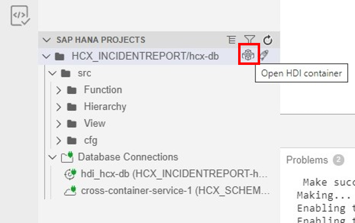
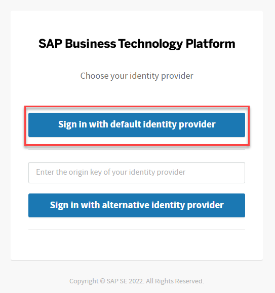
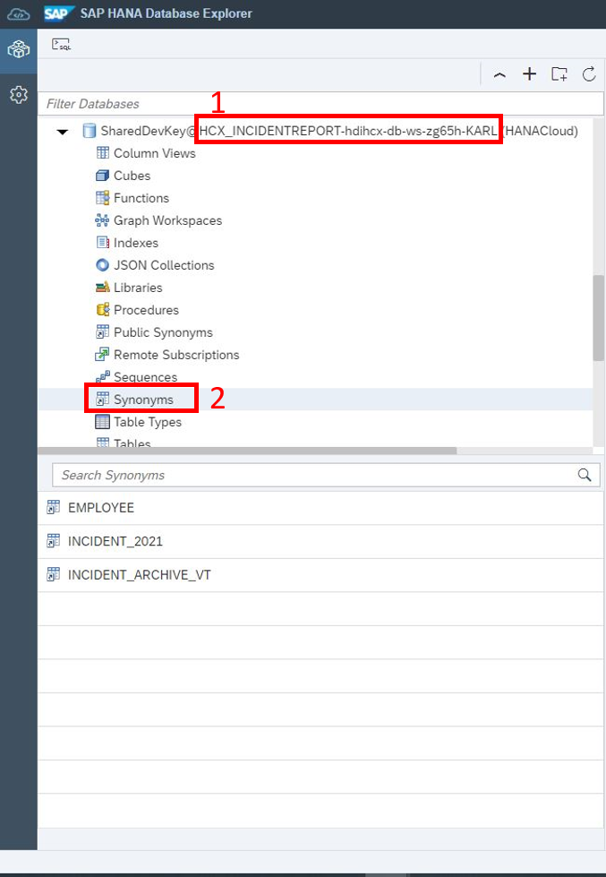
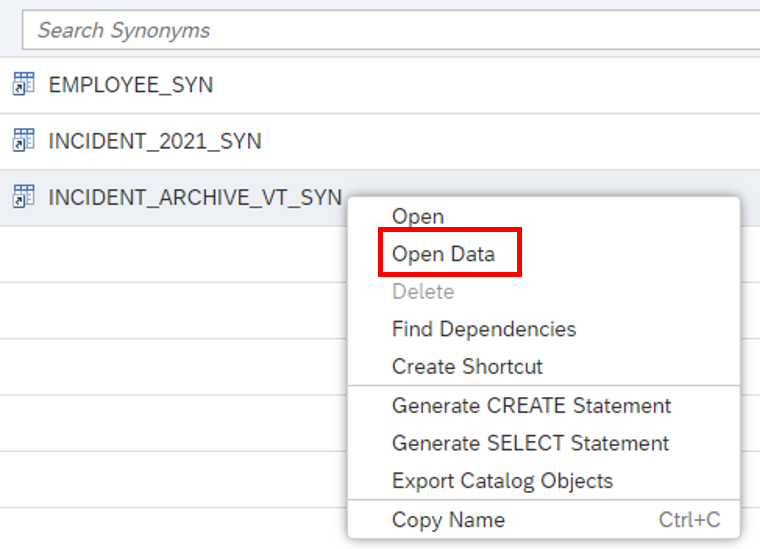
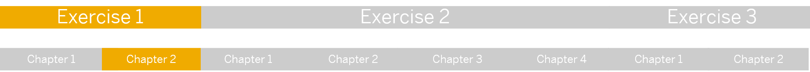

# Chapter 2: View the tables in Data Preview in the Database Explorer

< [Back to Chapter 1](./Exercise1_Chapter1.md)

## Table of contents

<!-- TOC -->

- [Chapter 2: View the tables in Data Preview in the Database Explorer]()
  - [Table of contents](#table-of-contents)
  - [Open HDI Container](#open-hdi-container)
  - [Database Explorer](#database-explorer)
  - [Explore table data](#explore-table-data)
  - [What you achieved in this chapter:](#what-you-achieved-in-this-chapter)

<!-- /TOC -->

## Open HDI Container

To view your deployed objects in SAP HANA Cloud, click on **Open HDI container** next to the rocket.

## Database Explorer

Click on **Sign in with default identity provider** and paste the platform username ``platformEA1811`` and the password ``Welcomek9cG0`` and click on **Next**.

The Database Explorer opens, in which you can see all the HANA objects currently available in your HDI container. As you can see from the database's name, you are currently within your recently created HDI container. Click on **Synonyms** to see the tables you are accessing through the user-provided service (which you created in Chapter 1).

## Explore table data

Right-Click on the **INCIDENT_ARCHIVE_VT_SYN** object and select **Open Data** to get an overview about the incidents, that happened in 2020 and are stored in the data lake. 

To explore all tables, proceede in the same way with the other synonym objects.

## What you achieved in this chapter:
- You successfully used the Database Explorer and  opend up your HDI Container.
- You opened up a table stored outside your HDI  Container in HANA Cloud using synonyms.

[Continue to next exercise](../Exercise%202/README.md) >
