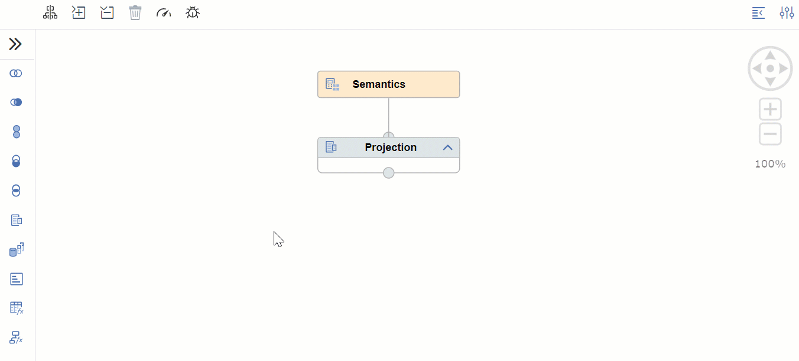
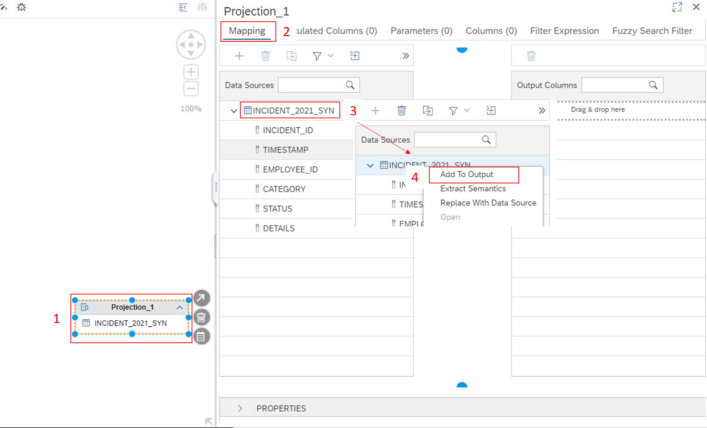

# Chapter 1: Combine incident data from different sources

< [Back to Exercise 2](./README.md)

## Table of contents

<!-- TOC -->

- [Chapter 1: Combine incident data from different sources](#chapter-1-combine-incident-data-from-different-sources)
  - [Table of contents](#table-of-contents)
  - [Create a new Calculation View](#create-a-new-calculation-view)
  - [Insert projection nodes](#insert-projection-nodes)
  - [Add a Data Source to the projection nodes](#add-a-data-source-to-the-projection-nodes)
  - [Mapping in the projection nodes](#mapping-in-the-projection-nodes)
  - [Unify the two projection nodes](#unify-the-two-projection-nodes)
  - [Mapping in the union node](#mapping-in-the-union-node)
  - [Set up the default projection node](#set-up-the-default-projection-node)
  - [Deploy to HANA Cloud](#deploy-to-hana-cloud)
  - [What you achieved in this chapter:](#what-you-achieved-in-this-chapter)

<!-- /TOC -->

## Create a new Calculation View

1. Switch back to BAS. Right-Click on **View** and click on **New File**. 

   
  
2. Name it: ``CV_INCIDENT_UNION_COMBINED.hdbcalculationview`` and click **OK**. The **.hdbcalculationview** specifies the Database Artifact Type, in our case the Calculation View.
   
   
 
3. Switch the Data Category to **Dimension** and click on **Create**. Calculation Views from type Dimension do not support data analysis but can be used as data source in other Calculation Views. 

   

## Insert projection nodes

The Graphical Editor Pane for the Calculation View opens. Expand the nodes on the left by clicking on **>>**. You see all the different nodes you can use within a Calculation View. Click on **Projection** and then click again on the **Editor Pane**  to drop this node. Add a second **Projection**.

## Add a Data Source to the projection nodes

1. Click on the **Projection_1** once, to see all the available options. By clicking the **+** symbol you can add a new data source to the **Projection_1**. 

   

2. The **Find Data Sources** - Popup allows you to search for data sources. To see a list of all available objects, insert ``**``. Select the **INCIDENT_2021** for **Projection_1** and click on **Finish**. 
   
    

3. For **Projection_2** select **INCIDENT_ARCHIVE_VT**.
   
   

4. It should look like this.
   
   

## Mapping in the projection nodes

1. Double click on **Projection_1** to open the **Mapping**. Right-click on **INCIDENT_2021_SYN** and select **Add To Output** to add all the columns from the data source to the output. 

   

2. Do the same with **Projection_2**.

## Unify the two projection nodes

1. Go back to the **Editor Pane** and insert a **Union Node**. Select the **Projection_1** again and click on the **Arrow** Symbol. Hold it and connect it to the **Union_1**. Do this also for the other projection node. 

   
   
2. It should look like this at the end:

   

## Mapping in the union node

Double Click **Union_1,** to open up the **Mapping** option. To automatically map the two tables together, use **>>** to expand the interactions and click on the **Mapping** **icon highlighted in red**. 

## Set up the default projection node

1. Connect the **Union_1** with the **Projection Node**, which has been created by default. Click on **Union_1** once and on the **arrow**. Hold it and **connect it to the Projection**.

   

2. Double click on the **Projection Node** to open the **Mapping** and right-click on **Union_1** and select **Add To Output**.
   
   

## Deploy to HANA Cloud

**Deploy** the created **Calculation View** by clicking on the **rocket** in the **SAP HANA PROJECTS** tab.
   

## What you achieved in this chapter:

- You created your first Calculation View in BAS.
- The Calculation View combines incident data from different data sources to one view.

[Go to Chapter 2](./Exercise2_Chapter2.md) >
