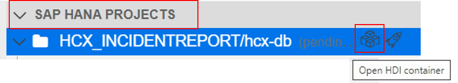
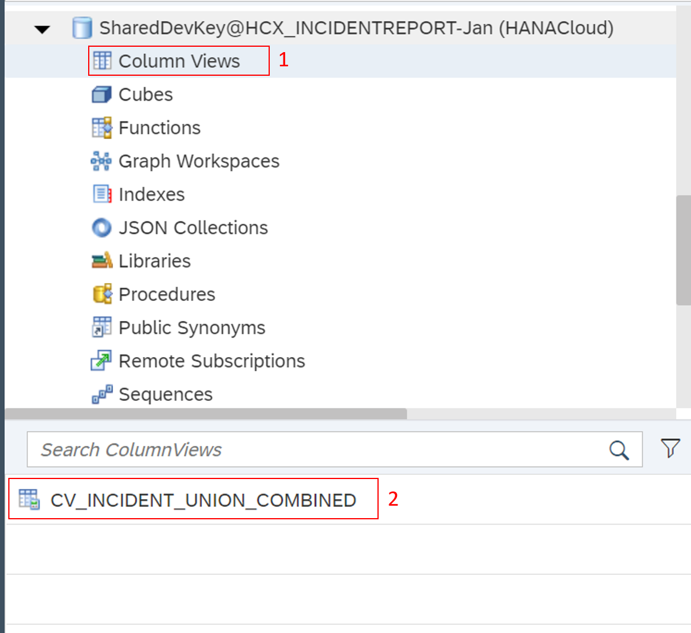
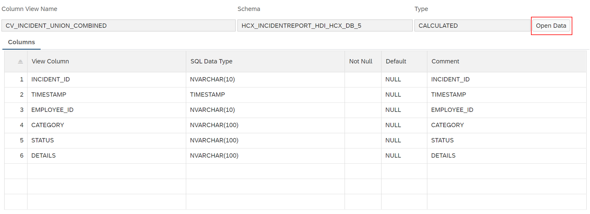
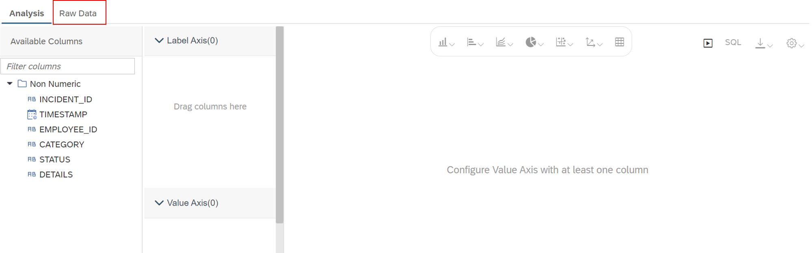
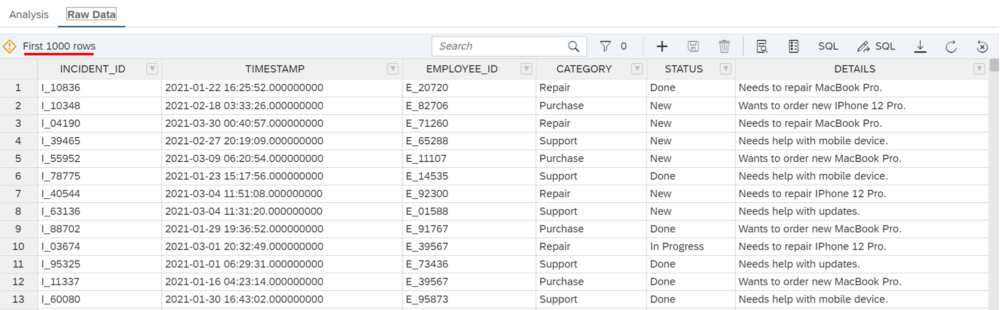
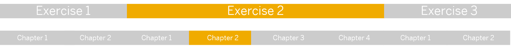

# Chapter 2: Preview the combined incident data

< [Back to Chapter 1](./Exercise2_Chapter1.md)

## Table of contents

<!-- TOC -->

- [Chapter 2 - Exercise 2: Preview the combined incident data](#chapter-2-preview-the-combined-incident-data)
  - [Table of contents](#table-of-contents)
  - [Switch to Database Explorer](#switch-to-database-explorer)
  - [Preview the data](#preview-the-data)
  - [What you achieved in this chapter:](#what-you-achieved-in-this-chapter)

<!-- /TOC -->

## Switch to Database Explorer

To see your created Calculation View results, switch to the **Database Explorer** by clicking on the **Open HDI container** symbol next to the rocket. 

## Preview the data

1. Click on **Column Views**. Click **CV_INCIDENT_UNION_COMBINED** to open details about the Calculation View.
    
   
    
2. Click on **Open Data**.
    
   
    
3. Click on **Raw Data** to see your data in table format. 
    
   
    
4. Explore the data.
    
   

## What you achieved in this chapter:

- You opened the full incident data in one view. The view contains 1000 rows, which is the sum of the rows of both incident sources.

[Go to Chapter 3](./Exercise2_Chapter3.md) >
