# Chapter 3: Create the Incident Report

< [Back to Chapter 2](./Exercise2_Chapter2.md)

## Table of contents

<!-- TOC -->

- [Chapter 3 - Exercise 2: Create the Incident Report](#chapter-3---exercise-2-create-the-incident-report)
  - [Table of contents](#table-of-contents)
  - [Create a new Calculation View](#create-a-new-calculation-view)
  - [Set up the projection nodes](#set-up-the-projection-nodes)
  - [Set up the aggregation node](#set-up-the-aggregation-node)
  - [Set up the join node](#set-up-the-join-node)
  - [Set up the semantics node](#set-up-the-semantics-node)
  - [Deploy to HANA Cloud](#deploy-to-hana-cloud)
  - [What you achieved in this chapter:](#what-you-achieved-in-this-chapter)

<!-- /TOC -->

## Create a new Calculation View

1. Switch back to BAS. Create a **New** **File** under the **View** folder and name it: ``CV_INCIDENT_REPORT.hdbcalculationview`` 

   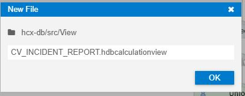
    
2. Select Data Category **CUBE** and click on **Create**. Calculation Views from type Cube support data analysis with multidimensional measure reporting. 
    
   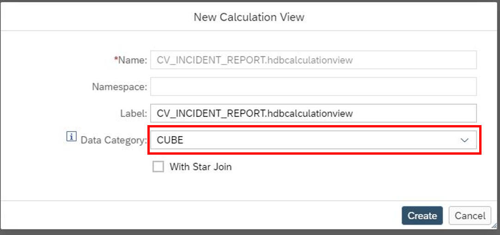
   
## Set up the projection nodes
    
1. Add two **Projection Nodes** to your Editor Pane. Select **Projection_1** and search for **EMPLOYEE**. Click on **Finish** to add the table to the **Projection_1**.
    
   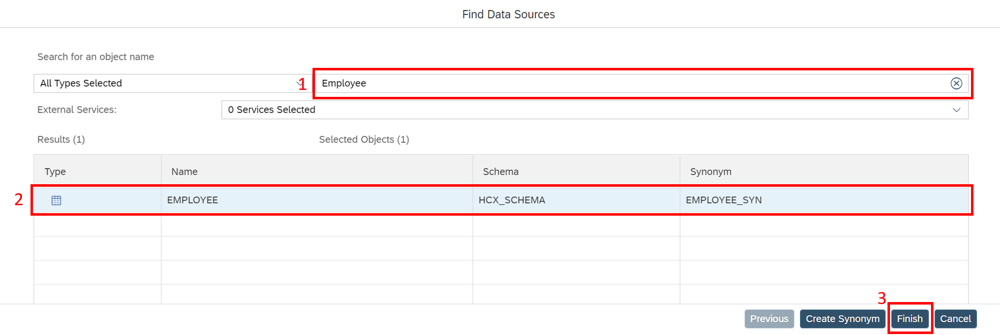
    
2. Map all columns of the **EMPLOYEE_SYN** to the output.

   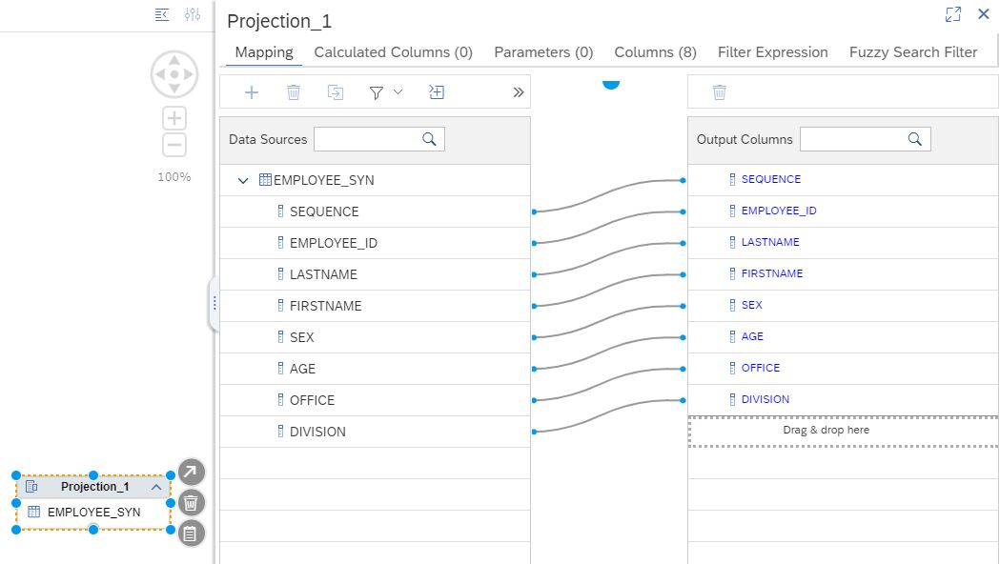
    
3. Select **Projection_2** and add the previously created Calculation View **CV_INCIDENT_UNION_COMBINED**. Only map **EMPLOYEE_ID** to the output. 
    
   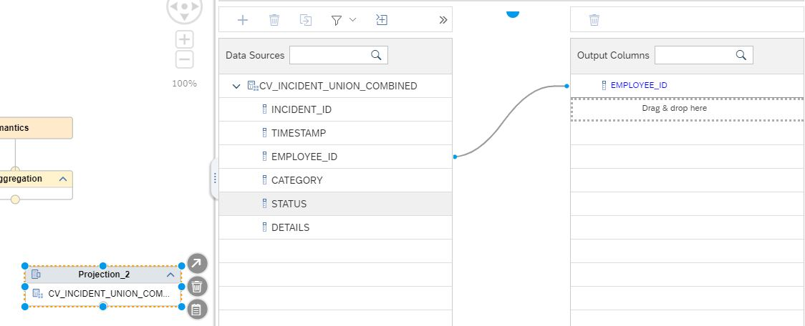

4. After you added the **EMPLOYEE_ID** to the output, you need to create a **Calculated Column** which calculates the number of incidents per employee. Switch to **Calculated Columns** and click on the **+ Sign** on the right. 
    
   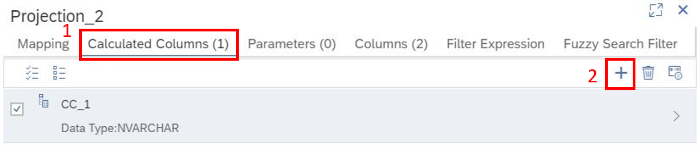
    
5. The general settings will be opened. Change the Name to ``CC_COUNTER``. Select **INTEGER** as **Data Type**. Expand **Expression** and type in ``1`` in the editor.
    
   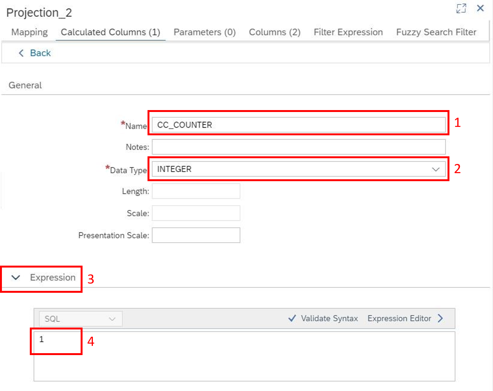
    
    This allows us to sum up the incidents per employee in the following node. Make sure to click on the Back button in the top left corner to save your changes. 

## Set up the aggregation node

1. Insert a new **Aggregation Node** and connect the **Projection_2** (**CV_INCIDENT_UNION_COMBINED**) to it. 
    
2. Double click on **Aggregation_1** and map both columns of **Projection_2** to the output. 
    
   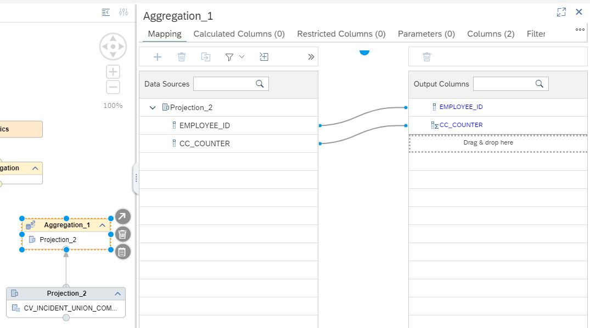
    
   This Aggregation node aggregates the number of incidents per employee for all incidents in the past. 

## Set up the join node

1. Add a new **Join Node** and connect the **Aggregation_1** Node and **Projection_1** Node containing the **EMPLOYEE_SYN** table.
    
   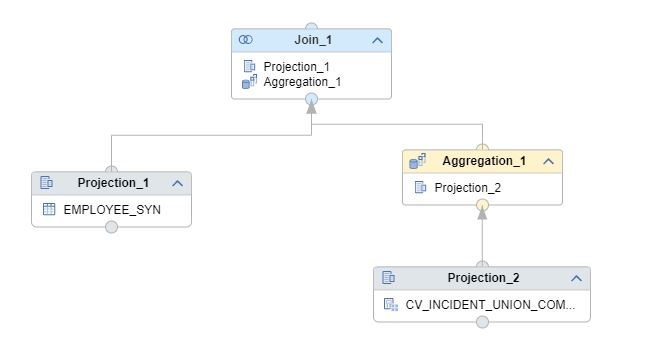
    
2. Double click on **Join_1** to open the **Join Definition**. Here, you define how you want to join the employee table and incident Calculation View together. In this step, you create sensitive data since you will map the number of incidents to the corresponding employee. Click and drag the **EMPLOYEE_ID** in **Projection_1** to the **EMPLOYEE_ID** in **Aggregation_1**. This will join the two tables together. Use **1:1** as **Cardinality**. 
    
   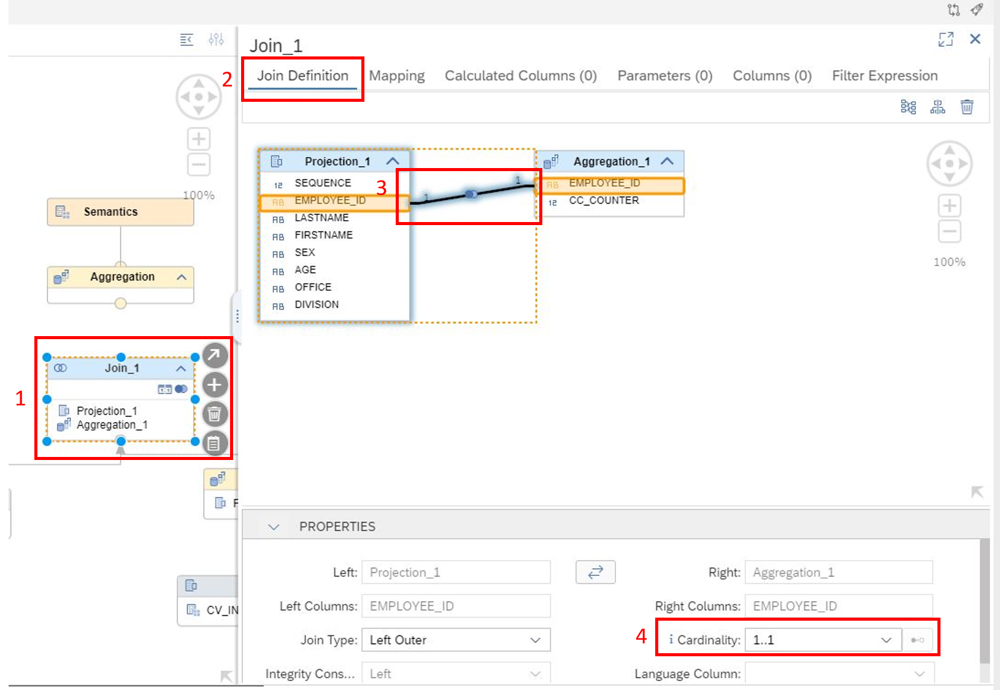
     
3. Click on **Mapping** within **Join_1** to map all Columns from **Projection_1** and only the **CC_COUNTER** Column from **Aggregation_1** to the Output. 
    
   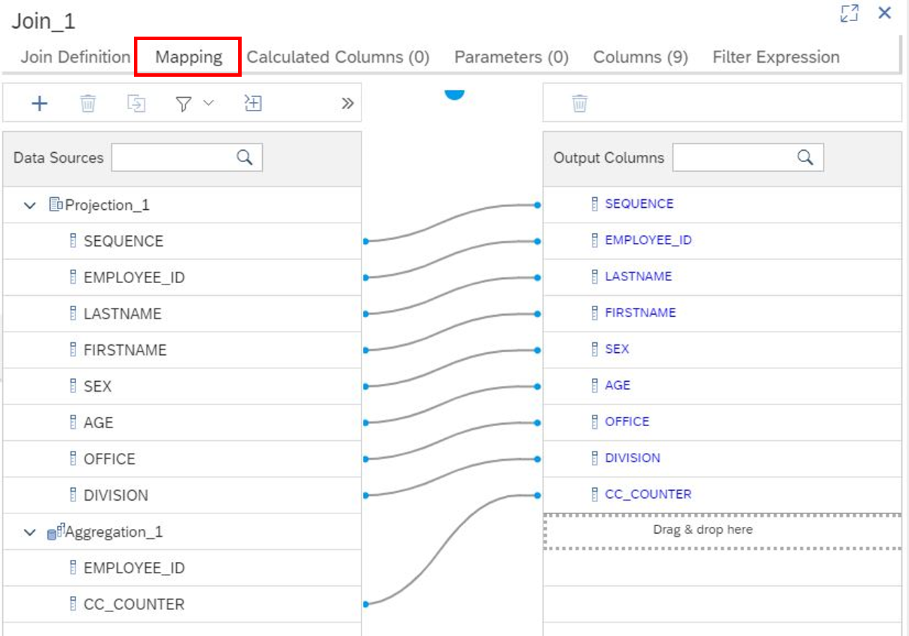

   If an employee had no incidents reported, the number of incidents will be displayed as NULL in the table. Although this is not a problem for further Calculations, some BI tools might run into issues. 

4. To solve this problem create another **Calculated Column** to enhance the data quality and display NULL values as 0. Click on **Calculated Columns** and add a new one within **Join_1**. Name it ``CC_INCIDENT_AMOUNT`` and make sure the data type is **INTEGER**. Add the following SQL Expression, which checks for NULL values and replaces them with 0: ``IFNULL("CC_COUNTER",0)``. Click on Validate Syntax to check if the SQL statement is correct.

   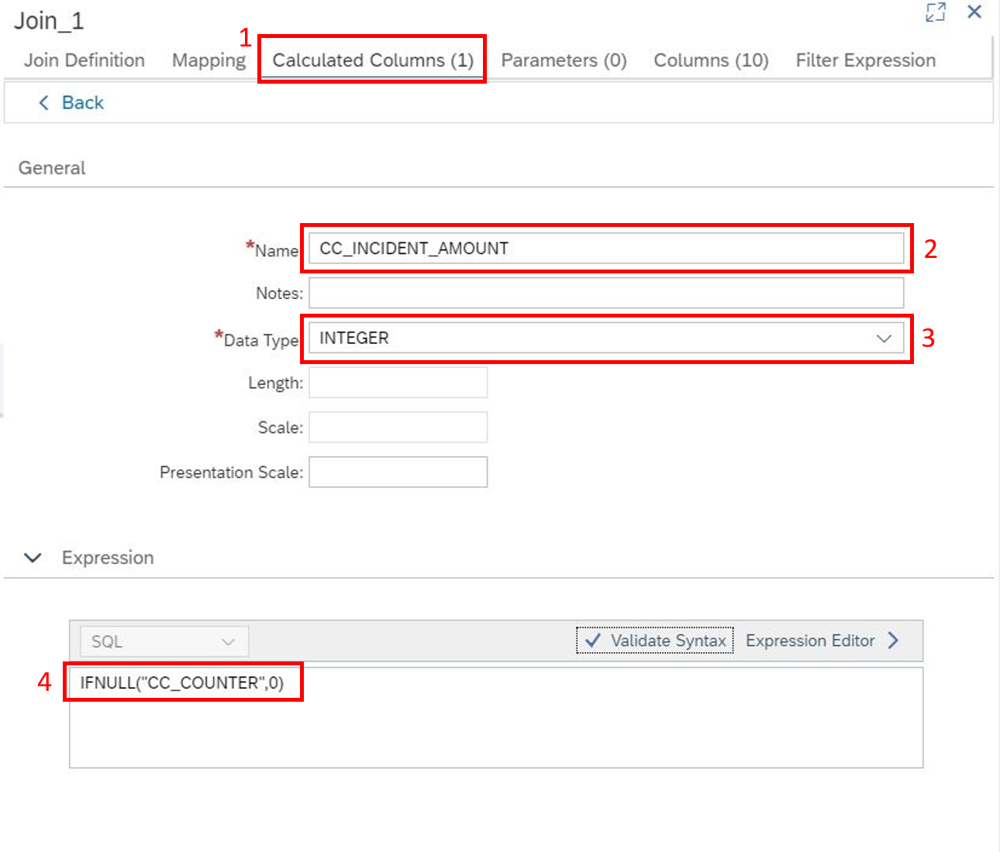
 
5. Connect **Join_1** with the standard **Aggregation Node**, which is automatically created when using Cube Calculation Views. **Add all columns to the output except for CC_COUNTER**, since the number of incidents is already included in the **CC_INCIDENT_AMOUNT**.

   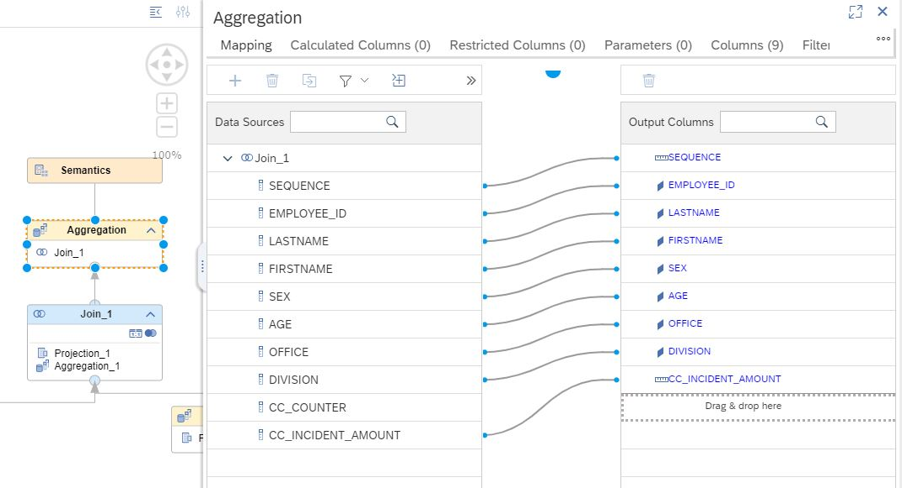

## Set up the semantics node

1. Double Click on the **Semantics Node** to be able to change the looks and details of the output View. Rename the column **CC_INCIDENT_AMOUNT** to ``INCIDENT_AMOUNT`` by clicking into the **Name**.

   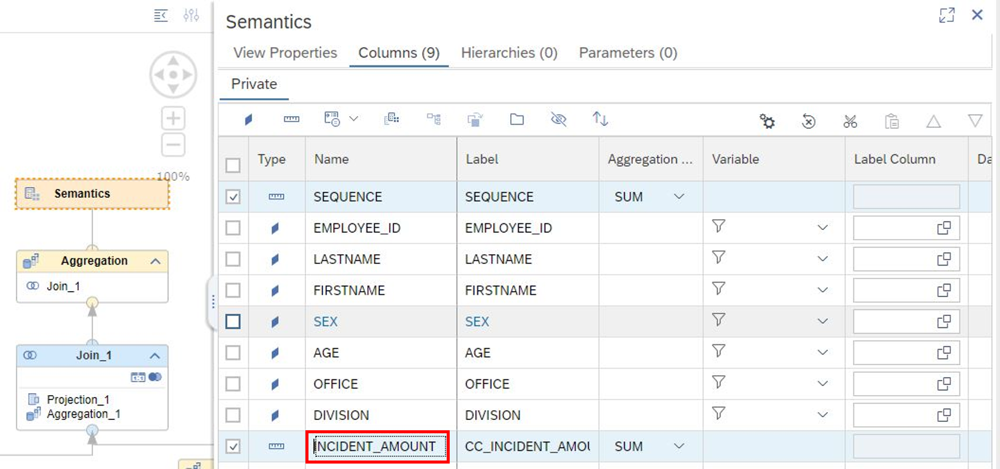
    
2. Change **SEQUENCE** from a measure to an attribute since **SEQUENCE**, in this case, is more like an ID, and we gain no insight out of it by using it as a measure. To do so select **SEQUENCE** and click on the **diamond** to change it to an **Attribute**.

   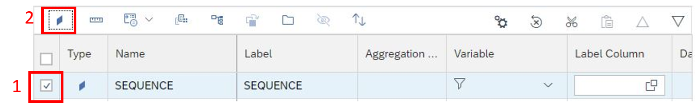
    
## Deploy to HANA Cloud

Deploy the Calculation View by clicking on the **rocket**.
   
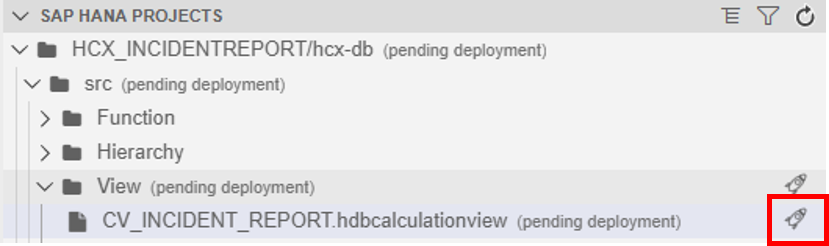

## What you achieved in this chapter:

- You created an Incident Report that contains all employee incidents from 2021 and the years before. Right now it is possible to see all the sensitive data. 
- To stay DSGVO conform, it is necessary to anonymize the data before reporting on it.

[Go to Chapter 4](./Exercise2_Chapter4.md) >

