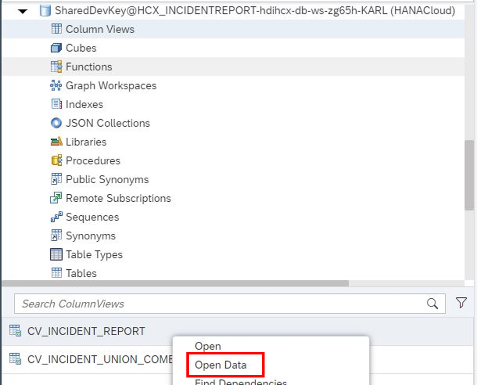
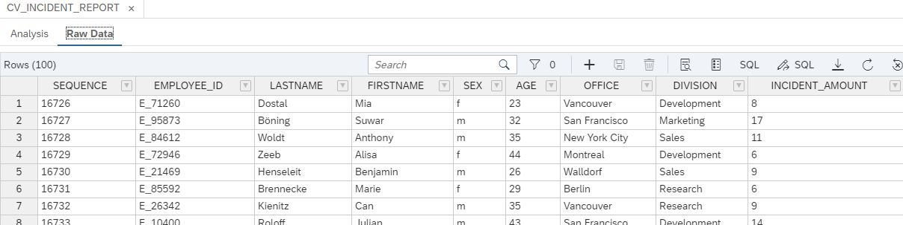
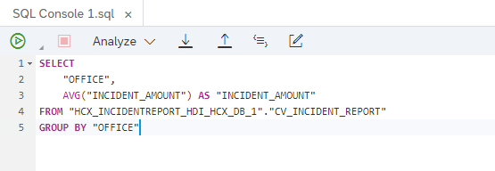

# Chapter 4: Preview the Incident Report

< [Back to Chapter 3](./Exercise2_Chapter3.md)

## Table of contents

<!-- TOC -->

- [Chapter 4: Preview the Incident Report](#chapter-4-preview-the-incident-report)
  - [Table of contents](#table-of-contents)
  - [Preview the data](#preview-the-data)
  - [Find some insights](#find-some-insights)
  - [What you achieved in this chapter:](#what-you-achieved-in-this-chapter)

<!-- /TOC -->

## Preview the data
Switch to the **Database Explorer** to see the sensitive data you created. Select **Column Views** and right-click on **CV_INCIDENT_REPORT**. Click on **Open Data** to see the Incident Report with all its details. 

    

    
Since the data you see is sensitive, we will need to anonymize our data so further business users can work with it and create insights.

## Find some insights

Now it's your turn to find out some insights of the created report. 

1) Right-click on **CV_INCIDENT_REPORT** and select **Generate SELECT Statement**.
2) Leave the SEQUENCE and the identifier columns (EMPLOYEE_ID, LASTNAME, FIRSTNAME) out of the statement to find some groups which are opening more tickets than others. The image below shows you an example.

   
   
   This results into the following.
   
   
   
   You can see that different office locations result in different incidents per employee. You can exchange the office column to other quasi-identifiers to check if they provide also different incidents per employee.

## What you achieved in this chapter:

- You opened the Incident Report which gives you an overview of how many incdients every employee has created.
- You gained some insight of the created report.

[Continue to next exercise](../Exercise%203/README.md) >
