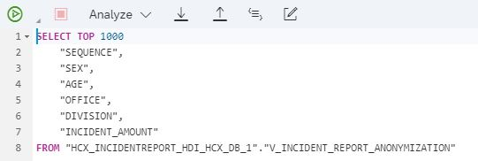
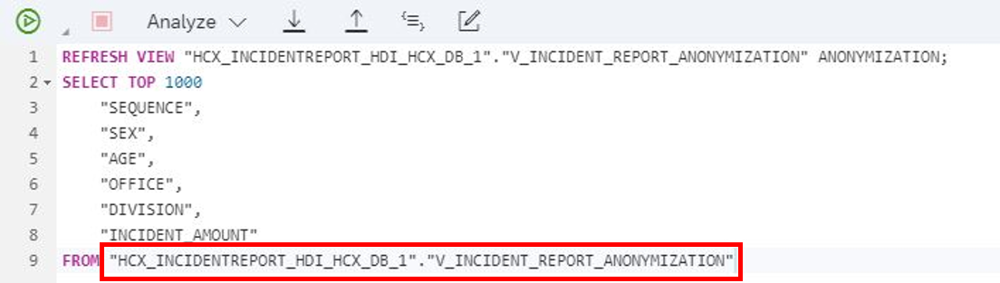
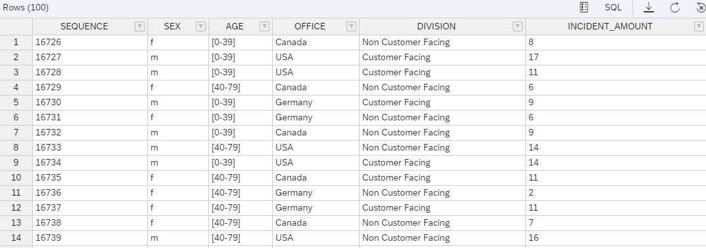
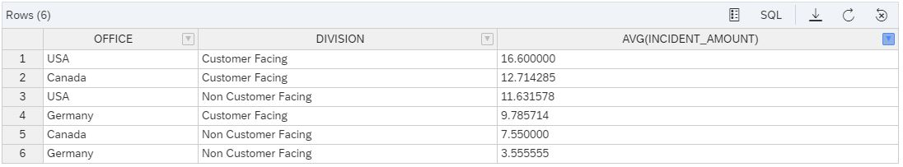

# Chapter 2: Explore the Anonymized Report

< [Back to Chapter 1](./Exercise3_Chapter1.md)

## Table of contents

<!-- TOC -->

- [Chapter 2: Explore the Anonymized Report](#chapter-2-explore-the-anonymized-report)
  - [Table of contents](#table-of-contents)
  - [Preview the anonymized report](#preview-the-anonymized-report)
  - [Explore the report and gain first Insights](#explore-the-report-and-gain-first-insights)
  - [What you achieved in this chapter:](#what-you-achieved-in-this-chapter)

<!-- /TOC -->

## Preview the anonymized report

1. Switch to the **Database Explorer** and open your **HDI Container**. Select **Views** in the catalog and right-click on **V_INCIDENT_REPORT_ANONYMIZATION**. Select the **Generate SELECT Statement**. This opens a SQL Console with the statement.

   

2. Before you can run the select statement, you need to **refresh** your View. To do so, **paste** the following code ``REFRESH VIEW XXXXXXXXXXXXXXXXXX ANONYMIZATION;`` into the console and above the previously generated statement. Please **copy** and **paste** the highlighted name from your select statement into the XXX area of the refresh View statement. 

   
   
   Click on the **green** **Play button** to execute both commands.

## Explore the report and gain first Insights

Explore the anonymized report. You will see that there is no way to identify a person through the given quasi-identifiers. 

Maybe you can find a group of employees opening more incidents than others by setting some group by clauses. 

## What you achieved in this chapter:

- No individual can be identified via the remaining information, but it is still possible to set up optimization processes based on the data. 

**Congratulations! You finished the Hands-On Exercises.**

< [Back to start](./README.md)

< [Back to Hands-On Overview](../README.md)
