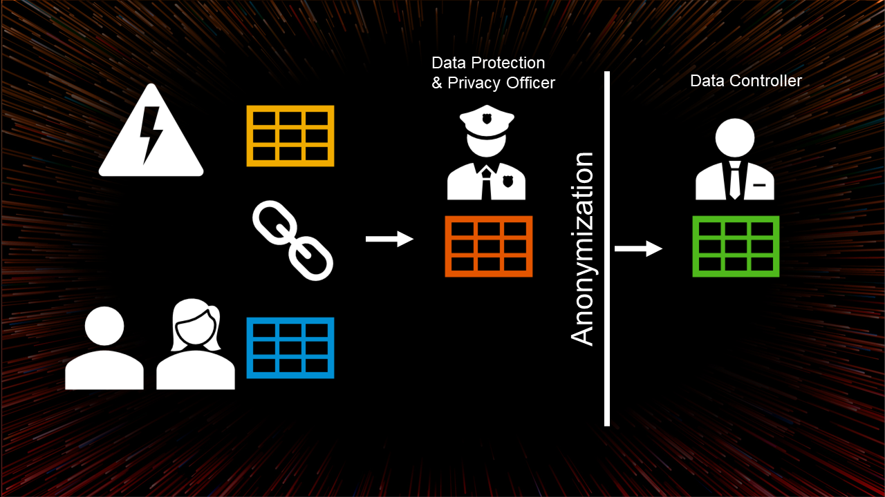
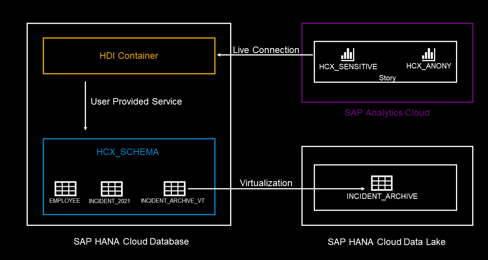

# SAP HANA Cloud Experience - Hands-On

## Script Overview

### Use Case

In this HANA Cloud Experience, you will get an overview of SAP HANA Cloud services, where to set it up, and how to use it. 
You will also create your own project and use the HANA algorithms to anonymize your data while getting a DSGVO / GDPR conform insight of your data.
Therefore you are going to use the principals of k-anonymity, which will be explained in the following [additional k-anonymity chapter](./Additional_Explanation_K-Anonymity_HCX.md).

Make sure to follow along and use the provided naming conventions. 

In case you have any questions, feel free to ask.

And remember:
**Have FUN!**

The image above shows the usecase you are working on today.

You will create an Incident Report that assigns every Employee the number of incidents created during the last two years. 
Therefore you are going to collect data from two different sources and join them in a calculation view.
This combined data represents highly sensitive data, which cannot be used for further DSGVO compliant analysis. 
As the Data Protection & Privacy Officer you need to make sure to anonymize the data before providing it to your data controller and other business users.
Although the data is anonymized, your business users can still gain valuable insights via SQL or SAP Analytics Cloud.

In this Hands-On Session, you will create your first project in Business Application Studio (BAS). You will create an HDI Container and use a preconfigured User-Provided Service to access data on HANA Cloud and data stored in the HANA Cloud Data Lake. A HDI (short for HANA Deployment Infrastructure) Container allows us to design database artifacts and deploy them to HANA Cloud. The mentioned Incident Report will be created in this HDI Container. In the end we will show you the anaylsis of the generated report via SAP Analytics Cloud as a demo.

The image above shows the explained archticture for this use case.

## Exercise Map

### Exercise 1: SAP Business Application Studio and Database Explorer
[Go to Exercise 1](./Exercise%201/README.md) >

### Exercise 2: Calculation Views
[Go to Exercise 2](./Exercise%202/README.md) >

### Exercise 3: Anonymization
[Go to Exercise 3](./Exercise%203/README.md) >
